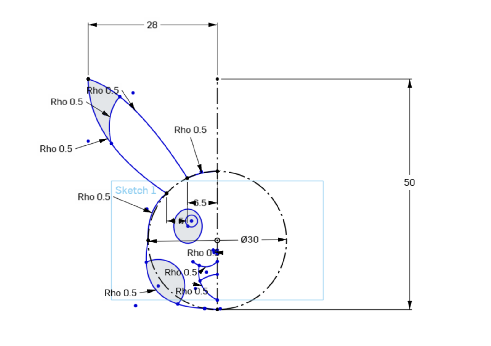
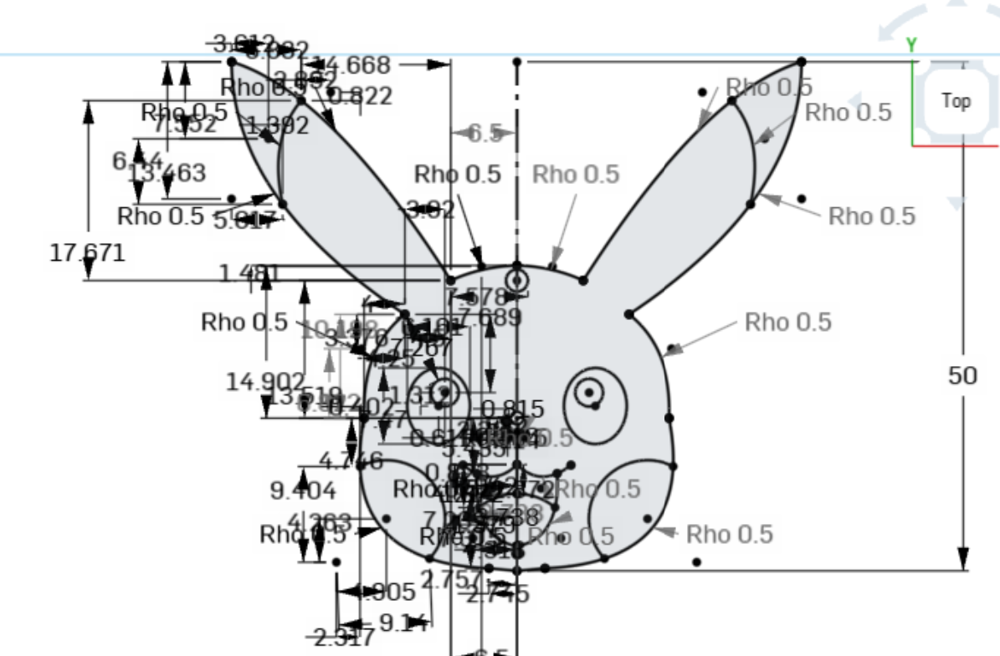
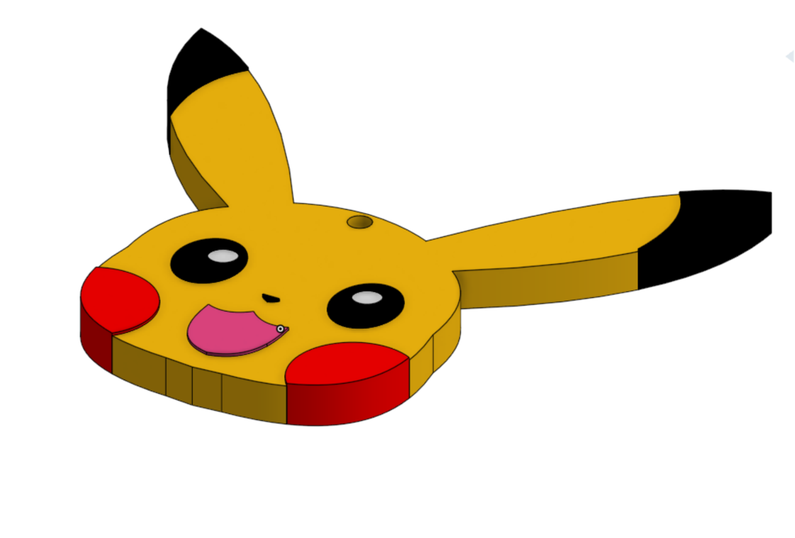

# Onshape_Task
A 3D-printable Pikachu-head keychain, designed from scratch in OnShape.

## How it was made
1. a profile was sketched of one side of Pikachu's face. after that the picture was mirrored and defined to complete the sketch

2. The finished 3D model, complete with color-separated features and a keyring hole.
 

## Files
 
- `Part_Studio_Keychain.stl` — 3D-printable STL file of the finished keychain

## Onshape Link
https://cad.onshape.com/documents/f9f72909ca765bffffc23244/w/7a4cae19601ac2a1139b9368/e/5fc9e3fe2f24dab92272c196?renderMode=0&uiState=6a5cd4785c6f284beb5dd0f2
